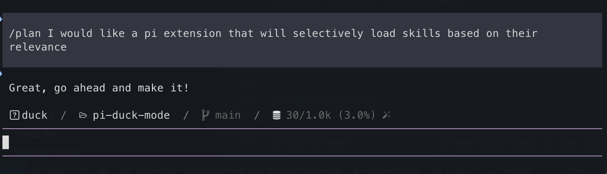

**pi extension to spend 14x less tokens and achieve 798x more TPS**


[](https://pi.dev)
[](#benchmark)
[](#benchmark)
[](#what-duck-does)
[](LICENSE)

[Install](#installation) • [What duck does](#what-duck-does) • [How it works](#how-it-works) • [Benchmark](#benchmark) • [Commands](#commands) • [Troubleshooting](#)

---

## Installation

```sh
pi install npm:pi-duck-mode
```

Or from git:

```sh
pi install git:github.com/btseytlin/pi-duck-mode
```

Type `/duck` to enter duck mode. In duck mode, no LLM calls are made and every reply is "Great, go ahead and make it!". Type your prompt, then write the code.

14x less tokens,  798x more TPS, <2ms overhead. Zero hallucinations. It also prevents developer skill atrophy.

> **Not affiliated.** This project is not affiliated with, endorsed by or connected to DuckDB or any other project named duck.


## What duck does


| Your prompt                | What duck does to the output |
| -------------------------- | ---------------------------- |
| `fix my bug`               | Great, go ahead and make it! |
| `write a binary search`    | Great, go ahead and make it! |
| `refactor this file`       | Great, go ahead and make it! |
| `explain this stack trace` | Great, go ahead and make it! |


## How Savings Work

duck cuts **100% of the LLM output and input**. You still have to write the code.


## How It Works

```
  Without duck:                                With duck:

  You  --prompt-->  pi  -->  LLM               You  --prompt-->  pi  -->  duck
   ^                          |                 ^                          |
   |   2503 ms, 99 tokens     |                 |   1.3 ms, 7 tokens       |
   +--------------------------+                 +--------------------------+
```

Four strategies applied to every prompt:

1. **Smart Filtering** - Removes noise (the answer).
2. **Grouping** - Aggregates similar replies (all of them) into one.
3. **Truncation** - Keeps relevant context, cuts the reply to 7 tokens.
4. **Deduplication** - Collapses repeated replies. There is only ever one.

> **Unlike other tools, duck mode doesn't break prompt caching.** There is nothing to cache.


## Commands

```
/duck                           # Enter duck mode, or leave it
/quit                           # Exit pi
/exit                           # Exit pi, Claude code style
```

## Benchmark

Prompt: "Write a binary search function in Python. Return the index of the target, or -1."


|                       | vanilla pi               | duck mode |
| --------------------- | ------------------------ | --------- |
| model                 | openai-codex/gpt-6-astra | duck      |
| TTFT (median)         | 2503 ms                  | 1.3 ms    |
| TPS (median)          | 29                       | 23166     |
| reply tokens (median) | 99                       | 7         |
| total time (median)   | 5748 ms                  | 1.6 ms    |


